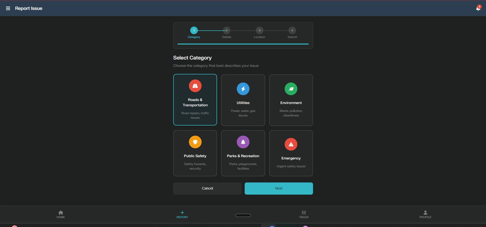
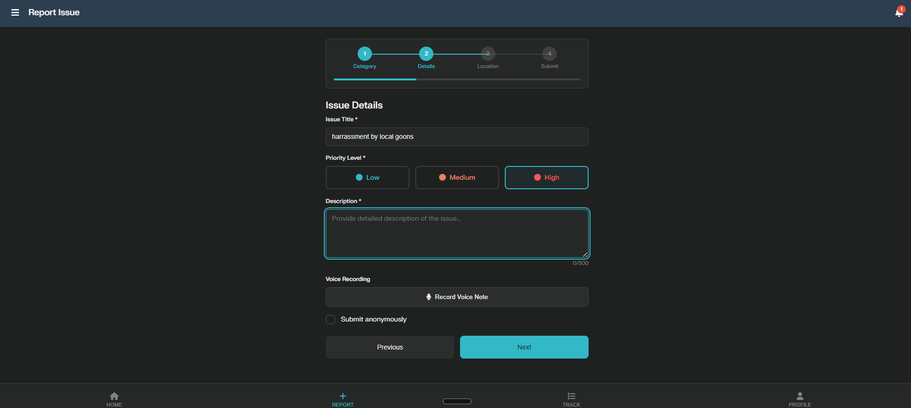

🌆 FixMySociety — Civic Issue Reporting Platform
🥈 2nd Prize — KIIT Internal Smart India Hackathon (SIH)

A modern platform where citizens report issues and administrators resolve them — creating cleaner, safer, better communities.

🎨 User Flow (Actual Screenshots)
🔵 1. Select Issue Category

🟠 2. Enter Issue Details

🟢 3. Add Location & Photos

🟣 4. Review & Submit

🟤 5. Track All Reports

🛠️ Admin Dashboard (Government-Ready)

An advanced admin interface for issue assignment, monitoring, staff management, filtering, and analytics — polished enough for real government deployment.

🔎 Project Overview

FixMySociety provides a fast and intuitive way for citizens to upload problems such as road damage, safety issues, environmental concerns, electrical hazards, or emergencies.
Administrators get a clean dashboard to view these reports, assign work, monitor progress, and maintain civic records — creating an effective communication loop between the public and authorities.

📌 User Flow
1. Select Issue Category

2. Enter Issue Details

3. Add Location & Photos

4. Review & Submit

5. Track All Reports

🛠️ Admin Dashboard

A dedicated admin interface for real-world civic issue management.

Admins can:

View and manage all incoming reports

Prioritize issues based on severity or number of submissions

Assign reports to staff or departments

Update status (Open → In Progress → Resolved → Closed)

Filter, search, and export data

Monitor civic activity and maintain workflow transparency

⭐ Core Features
👤 User Features

Upload photos and supporting evidence

Auto-detect or manually enter location

Record voice notes

Submit anonymously

Track issue status in real time

🛠️ Admin Features

Automated prioritization

Staff assignment and workload management

Status control with detailed tracking

Advanced filtering and data export

Notification and monitoring tools

🧰 Tech Used
Frontend

HTML5

CSS3

JavaScript

Tools

Git & GitHub for version control

JSON-based data handling

Local/Session Storage (if used)

🏆 Achievement

This project won 2nd place in the KIIT Internal Smart India Hackathon, recognized for:

Clean and intuitive user experience

Practical administrative workflow

Strong potential for real municipal deployment

Thoughtful design and smooth functionality

